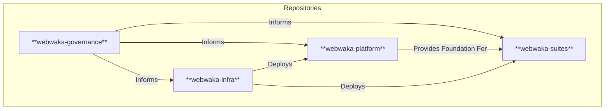

# Decision Area 1: GitHub Repository Structure

**Version:** 1.0 (Draft for Review)  
**Date:** January 30, 2026  
**Author:** Manus AI

---

## 1. Core Problem

The current single-repository approach (`webwaka`) is insufficient for the long-term vision of the WebWaka platform. It creates tight coupling, increases the risk of conflicts between parallel workstreams, and does not provide a clean separation of concerns between the platform foundation, services, capabilities, and suites. A world-class repository strategy is required to support scalability, parallel execution, and clear ownership boundaries for a multi-decade, multi-suite platform.

---

## 2. Analysis of Options

Three primary models were considered: monorepo, polyrepo, and a hybrid approach.

| Model | Description | Pros | Cons |
| :--- | :--- | :--- | :--- |
| **Monorepo** | A single, massive repository containing all code for the entire platform. | - Simplified dependency management. - Atomic cross-cutting changes. - Single source of truth. | - Performance issues at scale. - Tight coupling can lead to monolithic builds. - Complex permissions and ownership. |
| **Polyrepo** | A separate repository for every single capability, service, and suite. | - Clear ownership and separation of concerns. - Independent build and deployment pipelines. - Granular access control. | - Massive repo sprawl. - Complex dependency management (version hell). - Difficult to make cross-cutting changes. |
| **Hybrid (Recommended)** | A small number of thematically-grouped monorepos, organized by architectural layer and deployment lifecycle. | - Balances separation of concerns with manageable dependency management. - Enables parallel workstreams with clear boundaries. - Aligns with the platform's layered architecture. | - Requires disciplined governance to prevent scope creep within repos. - More complex than a single monorepo, but far less complex than a full polyrepo. |

---

## 3. Recommended Repository Topology (Hybrid Model)

I recommend a hybrid model consisting of **four primary repositories**, each with a distinct purpose and lifecycle. This topology provides a clean separation of concerns while avoiding the chaos of a full polyrepo approach.

### 3.1. `webwaka-governance`

*   **Contents:** The Master Control Board, all V3 canonical documents, phase definitions, decision records, and all other non-code governance artifacts.
*   **Purpose:** The single source of truth for **what** we are building and **why**. This is the entry point for all agents.
*   **Lifecycle:** Updated continuously. The `main` branch is always canonical.

### 3.2. `webwaka-platform`

*   **Contents:** The foundational code for the platform, including all Core Services (IAM, Ledger, etc.) and all Capabilities (MLAS, Reporting, etc.).
*   **Purpose:** Provides the stable, versioned foundation upon which all suites are built.
*   **Lifecycle:** Versioned using semantic versioning (e.g., `v1.0.0`, `v1.1.0`). Suites will depend on specific versions of the platform.

### 3.3. `webwaka-suites`

*   **Contents:** The code for all user-facing suites (Commerce, MLAS, Transportation, etc.). Each suite will be a separate package within this monorepo.
*   **Purpose:** The user-facing applications that consume the platform.
*   **Lifecycle:** Each suite can be versioned and deployed independently.

### 3.4. `webwaka-infra`

*   **Contents:** All infrastructure-as-code (Terraform, etc.) for deploying and managing the platform and suites.
*   **Purpose:** The `Compile & Deploy` engine for all deployment modes (SaaS, Partner, Enterprise).
*   **Lifecycle:** Aligned with the deployment needs of the platform and suites.

---

## 4. Versioning & Dependency Strategy

*   **`webwaka-governance`:** No versions. The `main` branch is the living, canonical source of truth.
*   **`webwaka-platform`:** Strict semantic versioning. Breaking changes will result in a major version bump (e.g., `v2.0.0`).
*   **`webwaka-suites`:** Each suite will be independently versioned. This allows a new version of the Commerce Suite to be deployed without requiring a new version of the Transportation Suite.
*   **Dependency Flow:** Suites will declare their dependency on a specific version of the `webwaka-platform` (e.g., `commerce-suite:v1.2.0` depends on `platform:v1.1.0`).

---

## 5. How This Supports Key Requirements

| Requirement | How This Model Supports It |
| :--- | :--- |
| **Separation of Concerns** | Each repository has a clear, distinct purpose, preventing scope creep. |
| **Parallel Execution** | Agents can work on different suites in the `webwaka-suites` repo in parallel without conflict. Foundational work in `webwaka-platform` is a separate, more controlled workstream. |
| **`Compile & Deploy`** | The `webwaka-infra` repo will consume versioned artifacts from `webwaka-platform` and `webwaka-suites` to create deployment manifests. |
| **Self-Hosted Clients** | Clients can be given access to specific, versioned suite packages and the corresponding platform version, without needing access to the entire codebase. |

---

## 6. Tradeoffs & Risks

*   **Tradeoff:** This model is more complex to set up than a single monorepo, but this initial investment will pay dividends in long-term clarity and scalability.
*   **Risk:** The `webwaka-platform` repository could become a bottleneck if not managed properly. A clear process for contributing to and releasing new versions of the platform will be required.

---

## 7. Open Questions for Founder

1.  Does this four-repository topology align with your long-term vision for the platform's structure?
2.  Are you comfortable with the proposed versioning strategy (platform is versioned, suites are independently versioned)?

---

## 8. Recommended Ratification Path

1.  **Review:** Founder reviews and provides feedback on this proposal.
2.  **Amend:** I will incorporate any feedback into a final version.
3.  **Ratify:** Founder provides final approval.
4.  **Execute:** I will create the new repositories and migrate the existing code and documentation into the new structure.
