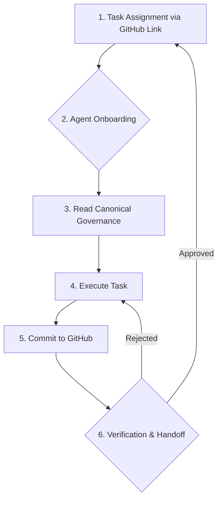

# Decision Area 2: Multi-Agent Vibe Coding Execution Model

**Version:** 1.0 (Draft for Review)  
**Date:** January 30, 2026  
**Author:** Manus AI

---

## 1. Core Problem

WebWaka is being built by a team of multiple, specialized AI agents (Manus, Replit, etc.). Without a formal execution model, this can lead to context loss, duplicated effort, and inconsistent architectural and governance standards. A tool-agnostic, account-agnostic execution model is required to ensure seamless, parallel collaboration and guaranteed continuity of the platform vision.

---

## 2. The "Vibe Coding" Execution Model

I propose a formal **"Vibe Coding" Execution Model**, where the "vibe" is the complete, canonical, and non-negotiable context defined in the `webwaka-governance` repository. This model ensures that any agent, regardless of its provider or specific tools, is always operating from the same source of truth.

### 2.1. Core Principles

*   **GitHub is the Supreme Source of Truth:** An agent's internal memory or state is irrelevant. The `webwaka-governance` repository is the only source of truth for what to build.
*   **Partial Context is Impossible:** An agent cannot be assigned a task without being given the entry point to the `webwaka-governance` repository. This ensures that the agent is always aware of the full context.
*   **Tools Enhance, They Do Not Define:** Agents can use any tools they need to execute, but the process must not create a dependency on a specific tool. The output must be standard code and documentation committed to GitHub.
*   **Handoff is Explicit and Verifiable:** Work is handed off between agents via pull requests and explicit sign-off, ensuring that all work is reviewed against the canonical governance documents.

### 2.2. The Execution Flow

This diagram illustrates the cyclical flow of the Vibe Coding model.

1.  **Task Assignment:** A task is assigned to an agent by providing a single link to a relevant document (e.g., a phase definition) in the `webwaka-governance` repository.
2.  **Agent Onboarding:** The agent's first action is to clone the `webwaka-governance` repository. This is a mandatory, non-skippable step.
3.  **Read Canonical Governance:** The agent reads the Master Control Board and any other relevant documents to fully understand the context, scope, constraints, and dependencies of the task.
4.  **Execute Task:** The agent executes the task, writing code to the appropriate repository (`webwaka-platform` or `webwaka-suites`).
5.  **Commit to GitHub:** All outputs (code, documentation, etc.) are committed to a new branch in the relevant repository.
6.  **Verification & Handoff:** The agent creates a pull request. A second agent (or a human) reviews the pull request to ensure it is fully compliant with the canonical governance. Once approved, the code is merged, and the task is complete.

---

## 3. How This Guarantees Continuity

| Guarantee | How This Model Provides It |
| :--- | :--- |
| **Architectural Continuity** | All agents are building against the same, versioned platform and the same set of architectural invariants. |
| **Governance Continuity** | The Master Control Board and all other governance documents are the first thing any agent reads. |
| **Decision History** | All decision records are stored in the `webwaka-governance` repository, providing a permanent, accessible history. |
| **Seamless Handoff** | Since the source of truth is always GitHub, any agent can pick up any task at any time simply by reading the canonical governance. There is no reliance on the internal state or memory of the previous agent. |

---

## 4. Open Questions for Founder

1.  Are you comfortable with the principle that GitHub, not any specific agent's memory, is the supreme source of truth for execution?
2.  Does the proposed pull-request-based verification and handoff process meet your requirements for quality control?

---

## 5. Recommended Ratification Path

1.  **Review:** Founder reviews and provides feedback on this model.
2.  **Amend:** I will incorporate any feedback into a final version.
3.  **Ratify:** Founder provides final approval.
4.  **Execute:** I will create a standard onboarding prompt and a set of contribution guidelines that enforce this model for all future agents.
